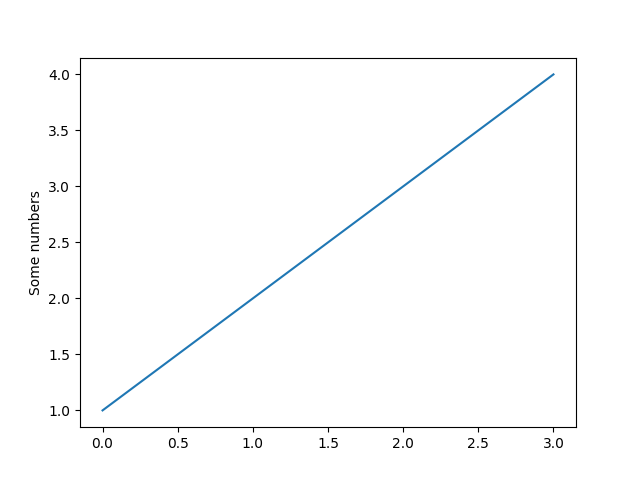
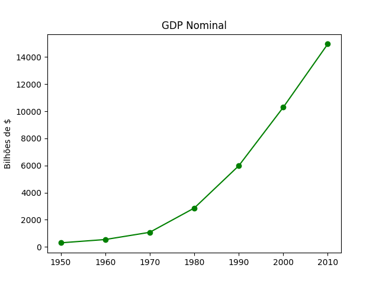
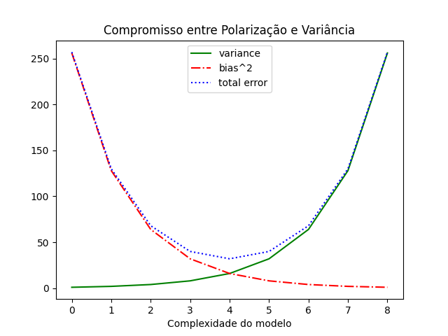
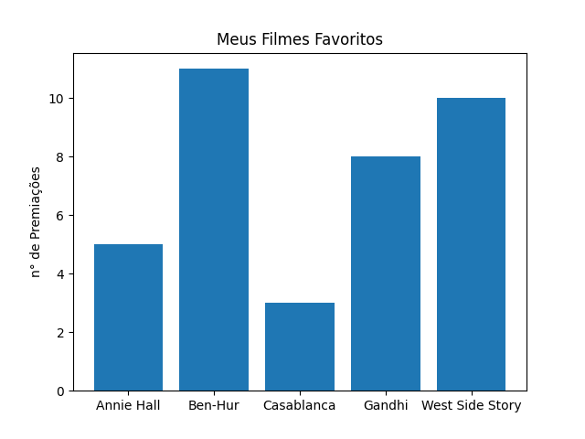
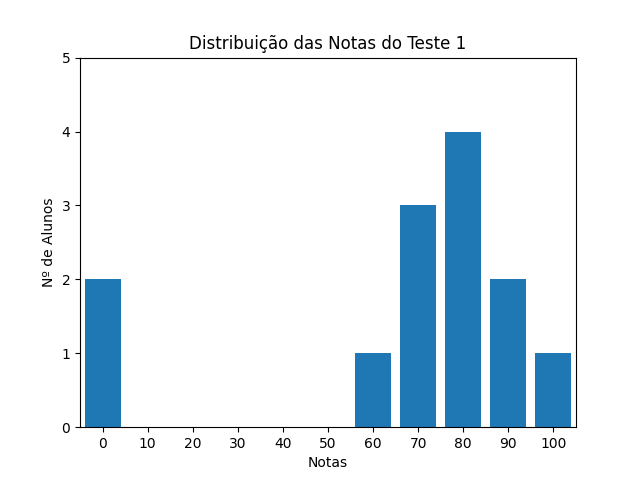
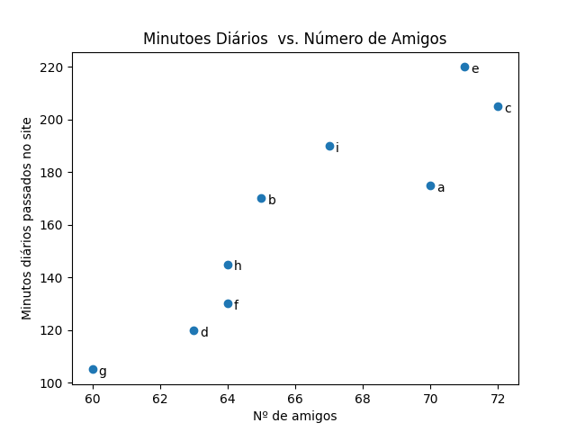

# Data visualization

A visualização dos dados é uma parte extremamente importante e existem várias ferramentas para visualizar dados utilizando Python:

- [Matplotlib](https://matplotlib.org/)
- [Plotly](https://plotly.com/)
- [Seaborn](https://seaborn.pydata.org/)
- [Altair](https://altair-viz.github.io/)
- [Bokeh](https://bokeh.org/)
- [Pygal](https://www.pygal.org/en/stable/)
- [Geoplotlib](https://github.com/andrea-cuttone/geoplotlib)
- [D3.js](http://d3js.org)
- [ggplot](http://bit.ly/1ycOk1u)

Durante o estudo irei focar no **Matplotlib**, mas experimentarei algumas outras bibliotecas quando necessário.

---

## Matplotlib

Segundo a [documentação oficial](https://matplotlib.org/stable/index.html), matplotlib é uma biblioteca abrangente para criar visualizações estáticas, animadas e interativas usando Python.

Veja alguns exemplos [aqui](https://matplotlib.org/stable/gallery/index.html).

### Instalando

#### Usando pip
```sh
pip install matplotlib
```

#### Usando conda
```sh
conda install matplotlib
``` 

### Pyplot

#### 1. Introdução

[Pyplot](https://matplotlib.org/stable/tutorials/introductory/pyplot.html) é um módulo da biblioteca que trabalha como o famoso [MATLAB](https://www.mathworks.com/products/matlab.html).

Trabalhar com Pyplot é simples e fácil. Com ele você pode construir uma visualização passo a passo.

Para fazer um gráfico simples:

```python
import matplotlib.pyplot as plt

plt.plot([1, 2, 3, 4])
plt.ylabel('Some numbers')
plt.show()
```
O resultado é a imagem abaixo:



#### 2. Gráfico de linha

Gráficos de linha são os mais comuns e são uma boa escolha ao mostrar tendências.
Para criar um gráfico de linha é simples, basta usar o comando `plt.plot()`:
```python
from matplotlib import pyplot as plt

years = [1950, 1960, 1970, 1980, 1990, 2000, 2010]
gdp = [300.2, 543.3, 1075.9, 2862.5, 5979.6, 10289.7, 14958.3]

# cria um gráfico de linha, anos no eixo x, gdp no eixo y
plt.plot(years, gdp, color='green', marker='o', linestyle='solid')

# adiciona um título
plt.title("GDP Nominal")

# adiciona um selo no eixo y
plt.ylabel("Bilhões de $")
plt.show()
```
Resultado:



Podemos personalizar o formato da linha:
```python
import matplotlib.pyplot as plt

variance = [1, 2, 4, 8, 16, 32, 64, 128, 256]
bias_squared = [256, 128, 64, 32, 16, 8, 4, 2, 1]
total_error = [x+y for x, y in zip(variance, bias_squared)]
xs = [i for i, _ in enumerate(variance)]

# Fazendo mútiplas chamadas de plt.plot() podemos mostrar mútiplos gráficos numa 
# única figura.

plt.plot(xs, variance, 'g-', label="variance") # linha verde sólida
plt.plot(xs, bias_squared, 'r-.', label="bias^2") # linha vermelha tracejada com ponto
plt.plot(xs, total_error, 'b:', label="total error") # linha azul pontilhada

# mostrando a legenda(label)
plt.legend()
plt.xlabel("Complexidade do modelo")
plt.title("Compromisso entre Polarização e Variância")
plt.show()
```
E o resultado será:



#### 3. Gráfico de barra

Quando queremos mostrar como algumas quantidades variam dentro de um _conjunto_ ou _categoria_, o gráfico de **barras** pode ser uma boa escolha.

Como exemplo, vamos montar um gráfico que mostra quantos Oscar cada filme ganhou:

```python
movies = ["Annie Hall", "Ben-Hur", "Casablanca", "Gandhi", "West Side Story"]
num_oscars = [5, 11, 3, 8, 10]

xs = [i for i, _ in enumerate(movies)]

plt.bar(xs, num_oscars)

plt.ylabel("n° de Premiações")
plt.title("Meus Filmes Favoritos")

# nomeia o eixo x com os nomes do filmes
plt.xticks([i for i,_ in enumerate(movies)], movies)

plt.show()
```
O código acima gera o seguinte gráfico de barras:



Gráficos de barras também são utilizados para criar histogramas, afim de explorar visualmente como os valores estão distribuídos.

```python
import matplotlib.pyplot as plt
from collections import Counter

grades = [83, 95, 91, 87, 70, 0, 85, 82, 100, 67, 73, 77, 0]
decile = lambda grade: grade // 10 * 10
histogram = Counter(decile(grade) for grade in grades)


plt.bar(
    [x for x in histogram.keys()],  # barra
    histogram.values(),             # altura correta
    8                               # largura da barra
)

plt.axis([-5, 105, 0, 5]) # eixo x de –5 até 105, eixo y de 0 até 5
plt.xticks([10 * i for i in range(11)]) # rótulos do eixo x em 0, 10, …, 100
plt.xlabel("Notas")
plt.ylabel("Nº de Alunos")
plt.title("Distribuição das Notas do Teste 1")
```
Este trecho de código nos fornece o seguinte histograma:



#### 4. Gráfico de dispersão

Se quisermos visualizar o relacionamente entre dois pares de conjuntos de dados, podemos usar um gráfico de dispersão.
No exemplo a seguir, o gráfico de dispersão mostra o relacionamente entre o número de amigos que seus usuários tem e o número de minutos que eles passam no site por dia:
```python
import matplotlib.pyplot as plt

friends = [ 70, 65, 72, 63, 71, 64, 60, 64, 67]
minutes = [175, 170, 205, 120, 220, 130, 105, 145, 190]
labels = ['a', 'b', 'c', 'd', 'e', 'f', 'g', 'h', 'i']

plt.scatter(friends, minutes)

# Nomeia as posições
for label, friend_count, minutes_count in zip(labels, friends, minutes):
    plt.annotate(label, xy=(friend_count, minutes_count), xytext=(5, -5), textcoords='offset points')

plt.title("Minutoes Diários  vs. Número de Amigos")
plt.xlabel("Nº de amigos")
plt.ylabel("Minutos diários passados no site")
plt.show()
```
A dispersão é mostrada na imagem:



